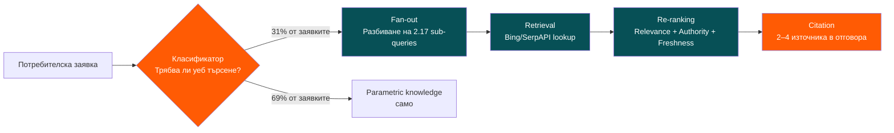
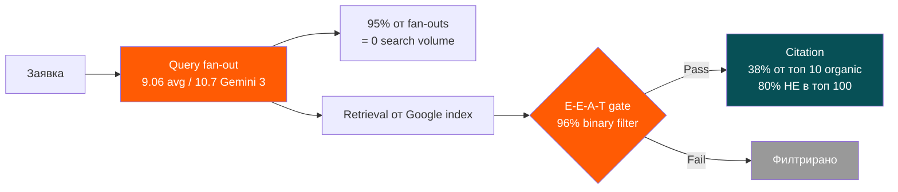
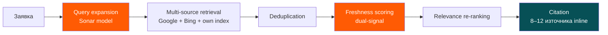
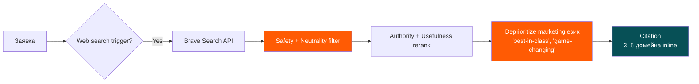
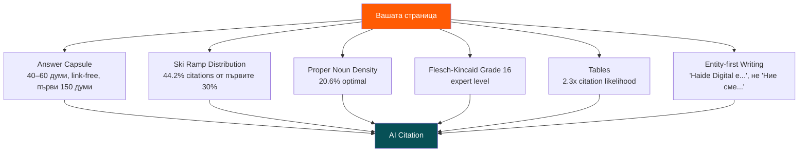

# Скрипт Част 1 — Въведение + „Как работят AI моделите"

> **Статус:** Итерация 1 / 3 (Въведение 3 мин + Част 1 от 30 мин).
> **Език:** Български (verbatim speaking script).
> **Обща дължина:** ≈33 мин от 90-минутния слот. ~5000 думи.
> **Slide count в тази итерация:** 23 слайда (1–3 intro, 4–23 Част 1).
> **Speaker:** Адриан Николов, Haide Digital.
> **Събитие:** Enterprise Magazine × EURODEA SEO Masterclass, София, 23 април 2026, 11:45–13:15.

---

## Навигационна таблица — слайдове 1–23

| # | Заглавие | Продълж. | Mermaid | Screenshot | QR |
|---|---|---|---|---|---|
| 1 | Title + self-intro | 1:30 | — | — | — |
| 2 | „Какво ще получите днес" (contract) | 1:00 | — | — | **Full screen** |
| 3 | Transition | 0:30 | — | — | master corner (from here onwards) |
| 4 | „Правилата за видимост се раздвоиха" | 1:00 | — | SS-01 | corner |
| 5 | LLM referral drop + CTR paradox | 1:00 | — | SS-02 | corner |
| 6 | Обещание + teaser | 1:00 | — | — | corner |
| 7 | ChatGPT pipeline (заглавие) | 0:30 | — | — | corner |
| 8 | ChatGPT 5-стъпков pipeline | 2:30 | **#1** | — | corner |
| 9 | ChatGPT fan-out числа | 1:30 | — | — | corner |
| 10 | GPT-5.3 vs GPT-5.4 split | 2:30 | — | SS-07 | corner |
| 11 | Google AI Mode pipeline (заглавие) | 0:30 | — | SS-04 | corner |
| 12 | Gemini 3 AIO fan-out pipeline | 2:30 | **#2** | — | corner |
| 13 | 95% zero-volume + E-E-A-T gate | 2:00 | — | — | corner |
| 14 | Lily Ray корелация | 2:00 | — | SS-08 | corner |
| 15 | Perplexity pipeline (заглавие) | 0:30 | — | SS-05 | corner |
| 16 | Perplexity 6-етапен Sonar RAG | 2:30 | **#3** | — | corner |
| 17 | Claude pipeline | 2:30 | **#4** | SS-06 | corner |
| 18 | Enterprise shift — Claude 45% | 1:30 | — | SS-09 | corner |
| 19 | Общи паттърни (заглавие) | 0:30 | — | — | corner |
| 20 | Cross-model common patterns diagram | 2:30 | **#5** | — | corner |
| 21 | Answer capsule + ski ramp числа | 1:30 | — | — | corner |
| 22 | Proper nouns + FK grade + tables | 1:30 | — | — | corner |
| 23 | Transition към Част 2 + handout cue | 1:00 | — | — | **Enlarged** |

**Total:** ~33:00 (3 мин въведение + 30 мин Част 1).

---

## QR код стратегия

- **Слайд 2** — QR пълен екран, caption: `haide.digital/masterclass-2026`. Адриан мълчи 5 секунди. „Сканирайте го сега. Всичко, което ще видите днес — чеклистът, инструментите, monitoring стака — живее там."
- **Слайдове 3–22** — QR малък в долен десен ъгъл като master slide element (постоянен, 80×80 px, без caption).
- **Слайд 23** — QR се увеличава в долен ляв ъгъл, caption: „Handout идва сега. Дигиталната версия — на този адрес."

---

## Screenshot checklist

| ID | Описание | Източник |
|---|---|---|
| **SS-01** | Google Search Central блог пост — 2MB HTML лимит обявен | Google Search Central Blog, 31 март 2026 |
| **SS-02** | Kevin Indig Growth Memo chart — 42.6% LLM referral drop (юли 2025 onwards) | Kevin Indig, Growth Memo newsletter |
| **SS-03** | *(резервиран, не се използва в Част 1)* | — |
| **SS-04** | Google AI Overview example с видими източници | Google SERP, live снимка от Haide Digital search test |
| **SS-05** | Perplexity отговор с 8–12 видими citation numbers | perplexity.ai, query за enterprise ERP |
| **SS-06** | Claude web search отговор с inline citations | claude.ai, query за B2B SaaS comparison |
| **SS-07** | Writesonic GPT-5.3 vs GPT-5.4 citation study | Writesonic blog, Samanyou Garg, 9 март 2026 |
| **SS-08** | Lily Ray Substack корелация chart — organic / AIO / AI Mode spans | Lily Ray Substack, март 2026 |
| **SS-09** | First Page Sage enterprise AI spend pie chart (януари 2026) | First Page Sage, април 2026 market share report |

**Screenshot capture deadline:** 5 април 2026 (за да има време за slide build преди 10 април).

---

## Mermaid диаграми — overview

| # | Слайд | Тема | Click count |
|---|---|---|---|
| #1 | 8 | ChatGPT 5-стъпков pipeline | 6 clicks |
| #2 | 12 | Google Gemini 3 AIO fan-out pipeline | 6 clicks |
| #3 | 16 | Perplexity 6-етапен Sonar RAG | 7 clicks |
| #4 | 17 | Claude Brave Search + safety filter | 6 clicks |
| #5 | 20 | Cross-model common patterns | 7 clicks |

Всяка диаграма има mermaid source + build sequence + synchronized speaker text в съответната секция долу.

---

# ВЪВЕДЕНИЕ (3 мин) — Слайдове 1–3

---

## Слайд 1 — Title + Self-intro (1:30)

**Slide visual:** Заглавие „Техническо SEO в AI ерата". Подзаглавие: „Как AI моделите избират кого да цитират — и какво можете да направите за това". Долу: „Адриан Николов · Haide Digital · 23 април 2026". Фон: Deep Sea Green #075056. Accent: Haide Orange #FF5B04.

**Script:**

Добро утро. Казвам се Адриан Николов. От седемнайсет години работя в search и organic растеж — като почнах като junior в една голяма българска агенция, минах през in-house роли в eCommerce и SaaS, и стигнах до момента, в който заедно с Мариана и Евгени основахме **Haide Digital**.

Ние сме това, което наричаме **Organic Growth Engineering** компания. На ежедневен език — ние не продаваме „SEO услуги". Ние **строим системи за растеж, които продължават да работят след като сме си тръгнали**. Разликата е проста. Услугата е като да наемете някой да ви коси тревата всяка седмица. Системата е като да си инсталирате автоматична поливна система — работи дори когато няма никой. Нашата цел не е да ви държим в договор с нас вечно. Нашата цел е да ви направим независими от нас — и от всяка агенция.

*[Пауза. Eye contact със залата.]*

За какво се боря точно сега? За това в 2026 enterprise брандовете в България да спрат да третират AI видимостта като **мода** — и да почнат да я третират като **инфраструктура**. Същото ниво на сериозност, с което сте подходили към CRM системата си, към site hosting-а, към счетоводния софтуер. Ако AI видимостта остане „проект, за който ще отделим време другия квартал" — ще загубите следващите пет години. Днес ще ви покажа конкретно какво значи да я третирате като infrastructure.

Позиционирам се между двамата колеги, които ще слушате днес. Мартин Желязков ви говори тази сутрин за философията на GEO — защо се променят правилата. Борислав Дончев след обяд ще ви говори за E-E-A-T и AI spam. **Моята роля е техническият мост между двете** — как се имплементира това, което Мартин каза, и как се защитавате от това, за което Борислав ще ви предупреди.

*[Смяна на тон. По-директно.]*

Ще бъде 90 минути гъста техническа работа. Няма да е презентация за вдъхновение. Ще е презентация за имплементация. Имам петнайсет минути по-малко от колкото ми трябва, затова ще карам бързо — но всичко, което виждате на екрана, го получавате в ръцете си. Да минем нататък.

---

## Слайд 2 — „Какво ще получите днес" Contract Slide (1:00)

**Slide visual:** Разделен на две половини. Лявата: четири bullet points с иконки (чеклист, инструменти, monitoring, call). Дясната: **QR код пълен екран височина**, под него caption `haide.digital/masterclass-2026`.

**[QR КОД: ПЪРВО ПОЯВЯВАНЕ — пълен екран, right side. Silent dwell 5 секунди.]**

**Script:**

Преди да почнем — искам да знаете какво си отивате с вкъщи от тази зала. Четири неща.

**Едно.** Пълен 60-точков технически чеклист за AI видимост — дигитална PDF версия зад QR кода. Ще минем през 20-те най-важни точки заедно в Част 2, останалите 40 можете да свалите и прегледате у вас.

**Две.** Пет безплатни инструмента, които Haide Digital публикува специално за този мастърклас. Ще ги видите на живо. Никаква регистрация, никакви лимити.

**Три.** Архитектура на monitoring стак — конкретна blueprint как да си построите система, която ви алармира когато AI моделите променят правилата. С n8n workflow JSON, GitHub Action, Notion template.

**Четири.** Безплатен 30-минутен Growth Gap Review за всеки в тази зала. Без product pitch. Чист data walkthrough на вашия сайт.

*[Жест към QR кода.]*

**QR кодът отдясно ви отвежда до всичко.** `haide.digital/masterclass-2026`. Сканирайте го сега, докато седите. Всичко, което ще видим днес — и още неща които няма да успеем да минем — живеят там.

*[Мълчание. 5 секунди. Оставяме хората да сканират.]*

---

## Слайд 3 — Transition (0:30)

**Slide visual:** Черен фон. Бял текст в центъра: „Преди чеклиста — как наистина работят тези системи."

**[QR КОД: от този слайд нататък — малък master element в долен десен ъгъл. Постоянен.]**

**Script:**

Бихме могли да минем директно към чеклиста. Но ако го направим — всяка точка в него ще звучи произволно. „Защо HTML да е под 2 мегабайта?" „Защо answer capsule от 40–60 думи?" „Защо Wikidata?" Без да знаете как работят pipeline-ите на ChatGPT, Gemini, Perplexity и Claude — това са просто правила. С тях — всяка точка става следствие от конкретна стъпка в pipeline-а.

Затова следващите 30 минути са за архитектурата. След това минаваме към чеклиста и инструментите.

---

# ЧАСТ 1 — Как наистина работят AI системите (30 мин)

## 1.1 Cold open — „Правилата за видимост се раздвоиха" (3 мин, слайдове 4–6)

---

## Слайд 4 — „Правилата за видимост се раздвоиха" (1:00)

**Slide visual:** Две колони. Лявата: Google логото, заглавието на блог поста (31 март 2026), ключови bullets (2MB HTML лимит, WRS statelessness). Дясната: ChatGPT/Claude/Perplexity лога с въпросителна отгоре.

**[SCREENSHOT: SS-01 — Google Search Central блог пост, 31 март 2026, 2MB HTML лимит]**

**Script:**

Ето едно признание, което Google направи преди по-малко от месец. На 31 март 2026 Google Search Central публикува официален блог пост — ще видите снимка отдясно. В него Google казва съвсем директно две неща:

**Първо — „Ние четем само първите 2 мегабайта от вашия HTML. Всичко след това — не го виждаме."** Две мегабайта е горе-долу като 400 страници обикновен текст в Word. Звучи много, но модерните сайтове — особено React и Next.js SPA-и — лесно стигат 5, 8, дори 15 мегабайта на страница. Всичко над 2MB — за Google е сякаш не съществува. Точка.

**Второ — „Нашият rendering service е stateless"**. На плейн български: всеки път, когато Google посещава вашата страница, идва **като пръв посетител**. Не помни, че вече е бил. Не пази кешове между посещения. Не знае какво сте променили вчера. Всичко се рендерира от нула, всеки път.

Това е първият път, в който Google ви казва **точно какво може и какво не**. И го ценя. Защото ако знаете ограничението, можете да го заобиколите.

*[Пауза. Поглед към дясната страна на слайда.]*

Сега — отдясно. ChatGPT, Claude, Perplexity, Gemini. **Никой от тях не ви е казал нищо подобно.** Няма публикуван документ „ето как решаваме кого да цитираме". Няма лимит в гигабайти. Няма прозрачност. Ако страницата ви не се цитира — просто не се цитира. Без обяснение.

Това е двуличието на 2026. Google е честен. AI моделите — не. И днес ще разберем какво те **не ви казват**, но данните показват.

---

## Слайд 5 — LLM referral drop + CTR paradox (1:00)

**Slide visual:** Един голям stat в център: **„42.6% спад в LLM referral traffic"**. Под него: „Kevin Indig, Growth Memo — юли 2025 до днес". Отдолу в по-малък шрифт: „Но цитираните брандове: +35% organic CTR, +91% paid CTR".

**[SCREENSHOT: SS-02 — Kevin Indig Growth Memo chart]**

**Script:**

Ето един брой, който ще ви спре за момент. **42.6% спад в LLM referral traffic от юли 2025 насам.** Това е данни на Kevin Indig от Growth Memo — ако не сте го абониран, го абонирайте тази вечер. Референтните кликове от ChatGPT, Claude, Perplexity към website-ове — надолу с почти половина за по-малко от година.

Първа реакция: „Значи AI видимостта е губеща игра. Ще се върна на Google."

*[Пауза.]*

Грешна реакция. Защото гледайте второто число.

**Брандовете, които се цитират в AI отговорите — имат 35% по-висок organic CTR в Google. И 91% по-висок paid CTR.** Същите тези брандове. Същите SERPs.

Какво значи това? AI цитиранията не са кликове сами по себе си. **Те са доверие.** Когато потребителят види вашия бранд в ChatGPT отговор и после ви види в Google SERP — той кликва. Когато не ви види — не кликва. AI видимостта не е канал — тя е **пре-кликова валидация на бранда**.

Затова днес не говорим за „AI трафик". Говорим за **AI доверие**. И как да го заслужите в очите на четири различни pipeline-а.

---

## Слайд 6 — Обещание + teaser (1:00)

**Slide visual:** Четири логa — OpenAI, Google, Perplexity, Anthropic. Под всяко: въпросителен знак и процент („31% trigger rate", „70%+ AIO", „8–12 citations", „45% enterprise spend"). Долу: „Следващите 25 минути — pipeline на всеки."

**Script:**

Обещание за следващите 25 минути. Ще мина през pipeline-а на всяка от четирите AI системи, които имат значение в 2026 — ChatGPT, Google AI Overviews и AI Mode, Perplexity и Claude. За всяка ще ви покажа:

- **Как решава** дали изобщо да търси в уеб.
- **Как разбива** вашата заявка на под-заявки, които вие никога не виждате.
- **Как избира** кои източници да cititра.
- **И какво означава това** за вашия сайт, конкретно.

С числа. С източници. Без обобщения. Защото в края на тези 25 минути, когато видите чеклиста, всяка точка в него ще се връзва с конкретна стъпка от конкретен pipeline.

Да почнем с ChatGPT.

---

## 1.2 ChatGPT Pipeline (7 мин, слайдове 7–10)

---

## Слайд 7 — ChatGPT Pipeline заглавие (0:30)

**Slide visual:** Голямо ChatGPT лого в center. Подзаглавие: „Класификатор → Fan-out → Retrieval → Re-ranking → Citation". Долу дребно: „Nectiv Digital, Writesonic, март 2026".

**Script:**

ChatGPT pipeline. Пет стъпки. На следващия слайд ще ги видим визуално и ще разпакетираме всяка.

---

## Слайд 8 — ChatGPT 5-стъпков pipeline (2:30)

**Slide visual:** Mermaid диаграма #1, хоризонтална. Пет nodes. Build animation: всеки node се появява на click.

**[MERMAID #1: ChatGPT Pipeline]**

**Build sequence (6 clicks):**

| Click | Появява се | Говорим текст |
|---|---|---|
| 1 | `Q` (Заявка) + `C` (Класификатор) | „Първата стъпка — класификаторът." |
| 2 | Split: `P` (Parametric) клон | „69% от заявките ChatGPT НЕ ги търси в уеб." |
| 3 | `F` (Fan-out) клон + „31%" label | „Останалите 31% влизат във fan-out." |
| 4 | `R` (Retrieval) | „Fan-out заявките отиват към Bing/SerpAPI." |
| 5 | `RR` (Re-ranking) | „Върнатите резултати се пре-класират." |
| 6 | `CIT` (Citation) | „И накрая — 2–4 източника в отговора." |

**Script (synchronized with clicks):**

Нека мислим за ChatGPT не като за магия, а като за много организиран офис. Петима служители, всеки със своя работа. Заявката ви минава през всичките петима, един след друг.

**[CLICK 1]** Първият служител е **секретарката на входа**. Когато напишете нещо в ChatGPT, този служител първо трябва да реши: „Трябва ли изобщо да вдигна слушалката и да се обадя в уеб? Или шефът вече знае отговора и мога да му го предам директно?" Това е **класификаторът**. Той е сложил една ръка върху телефона, другата — върху папката с вече наизустените отговори.

**[CLICK 2]** И ето първата шокиращо проста истина: **в 69% от случаите секретарката решава да не се обажда никъде.** Две трети от заявките ChatGPT отговаря само от това, което вече помни наизуст от тренирането — без никакъв уеб search. Това са данни на Nectiv Digital, Chris Long, изследване върху 8,500 реални разговори.

Преведено на ваш език: в две трети от случаите вашият сайт няма никакъв шанс да бъде цитиран. Не защото съдържанието ви е лошо. А защото **играта дори не започва**. Представете си, че сте в ресторант и келнерът препоръчва ястия от менюто. Ако вашият ресторант не е в главата на келнера още от началото — няма да ви препоръча, независимо колко добра храна правите. Това е borderline brand recognition. Или моделът вече е „чел за вас" в training-а си, или не ви споменава. Точка.

**[CLICK 3]** Другите **31%** минават нататък към втория служител — **детектива**. Той взема вашата заявка — примерно „коя е най-добрата ERP система за верига магазини" — и казва: „Чакай, тази заявка е твърде обща. Трябват ми 9 junior детектива, всеки да провери различно нещо." И ги пуска паралелно.

Това се нарича **fan-out**, или на български — разбиване на заявката на множество паралелни под-заявки. Старият ChatGPT (GPT-5.3) пускаше 2 junior детектива. Новият (GPT-5.4) — **осем и половина пъти повече**. Средната дължина на всяка под-заявка е **5.5 думи** — тоест не е „ERP системи", а „ERP системи за верига магазини с многоезична поддръжка за Източна Европа". Моделът не търси вашата заявка. Той търси **осем по-точни варианта на вашата заявка, които вие никога не виждате**.

**[CLICK 4]** Трети служител — **куриерът**. Той взема 8-те под-заявки на детектива и ги носи до един конкретен адрес: **Bing**. Защо Bing, а не Google? Защото Microsoft и OpenAI имат сделка. ChatGPT няма свой собствен crawler — плаща на Bing да търси вместо него.

Това е първото много практическо правило, което можете да приложите тази вечер: **ако сайтът ви не е индексиран в Bing, вие буквално не съществувате за ChatGPT.** Повечето български маркетолози никога не са отваряли Bing Webmaster Tools. Направете го. Безплатно е, регистрацията отнема 10 минути, и без него всичко останало днес е безсмислено.

**[CLICK 5]** Четвърти служител — **редакторът**. Bing връща, да кажем, 50 резултата за всяка под-заявка. Но ChatGPT не ги използва директно. Редакторът ги преподрежда по свои критерии: кой е authoritative, кой отговаря най-ясно, кой е по-скорошен. Това е **re-ranking** — същото като редактор във вестник, който решава кое отива на първа страница, кое — на четвърта.

**[CLICK 6]** И пети, последен служител — **говорителят**. Той взема пре-подредения списък и избира **2 до 4 източника**, които ще bъдат цитирани в отговора. Само 2 до 4.

Спрете за момент. Не 10. Не 20. **Две до четири.** Целият ви SEO, целият ви content strategy, цялата ви Haide инвестиция — всичко се стреми към това да бъдете в тези 2–4 имена на върха. Това не е „стани топ 10 на Google". Това е **стани топ 4 в главата на AI модел, който ви избира от 50 кандидата.**

---

## Слайд 9 — ChatGPT fan-out числа (1:30)

**Slide visual:** Големи цифри в сетка: „31% trigger rate" / „2.17 → 18.4 fan-out depth" / „5.5 думи avg" / „2–4 citations". Източници долу.

**Script:**

Четири числа, които ще ни трябват по-късно. Ще ги запишете или ще си ги снимате.

**31%** — колко често ChatGPT изобщо отива да търси в уеб. В останалите 69% просто отговаря наизуст.

**От 2 до почти 20 под-заявки** — толкова много скрити search-а тригерва един ваш единствен prompt в най-новия модел. Спомнете си — вие виждате един въпрос, моделът изпълнява двадесет.

**5.5 думи средна дължина** на тези под-заявки. И тук е ключът: това са **човешки изречения, не ключови думи**. „Как да мигрирам от HubSpot към Salesforce без загуба на данни" — ето това търси AI моделът. Не „CRM". Не „migration". Цяло изречение. Ако вашето съдържание е писано в keyword-стил — „CRM migration services Bulgaria" — моделът не ви разбира като отговор на реалния въпрос. Ако е писано в човешки стил — „Ето как да мигрирате от HubSpot към Salesforce за три седмици без да загубите нито един контакт" — ви разбира.

**2 до 4 citations** — финалната тясна врата. Помните ли петимата служители? Петият избира между 2 и 4 сайта. Това е всичко.

---

## Слайд 10 — GPT-5.3 vs GPT-5.4 split (2:30)

**Slide visual:** Split screen. Лявата половина: „GPT-5.3 — 92% brand website citations". Дясната: „GPT-5.4 — 56% brand website, 44% third-party". Долу централно: **„Overlap: 7%"**. Най-долу: **„75% от GPT-5.4 citations НЕ са в Google organic top 100"**.

**[SCREENSHOT: SS-07 — Writesonic GPT-5.3 vs 5.4 study]**

**Script:**

Сега нещо, което ще ви изненада. Искам да ме слушате внимателно, защото ще разкаже една много конкретна история за 2026.

Представете си двама души в тази зала. Иван и Мария. Иван има безплатен ChatGPT акаунт — той ползва стария модел, GPT-5.3. Мария плаща $20 на месец за Pro — тя ползва новия, GPT-5.4. Седят един до друг. Питат **абсолютно един и същ въпрос**: „Кои са най-добрите SEO агенции в България?"

Колко мислите, че ще е припокриването в отговорите им? 80%? 60%?

*[Пауза. Изчакване на реакция от залата.]*

**Седем процента.** Седем. Иван и Мария виждат буквално **два различни интернета**. Това не е грешка. Не е bias. Това е различна архитектура на модела.

Това е данни от Writesonic, Samanyou Garg, изследване от 9 март 2026. Взели са 10,000 отговора от стария модел и 10,000 от новия, за едни и същи заявки. Намерили са:

- **Старият модел (GPT-5.3)** цитира **brand websites** — тоест самите компании — в 92% от случаите. Логично. „Коя е най-добра ERP?" → отиваш на сайта на SAP, на Oracle, на Microsoft Dynamics. Нормално.
- **Новият модел (GPT-5.4)** цитира brand websites само в **56%** от случаите. Останалите 44% отиват към **Reddit, форуми, review сайтове, новини, YouTube transcripts**. Моделът е започнал да **не вярва на марките за самите тях**. Иска странична валидация.

И сега финалното, най-шокиращото число. Седнете за това.

*[Бавно, силно.]*

**75% от това, което новият ChatGPT цитира, не е в топ 100 на Google organic** за същата заявка.

Чуйте го пак. Три четвърти от източниците, които ChatGPT препоръчва, **изобщо не ранкират в топ 100 на Google**. Не на първа страница, не на десета — изобщо не в първите сто. Това означава, че всичко, което сте учили за SEO от 10 години насам — „класирай се на първа страница", „влез в топ 10" — това все още работи за Google. Но **не гарантира нищо** за ChatGPT.

Това е причината днес да сме тук. Не за да ви уча SEO. Знаете SEO. Днес ви уча какво е **различното**. Защото ако играете само по старите правила, ще спечелите Google и ще загубите следващите десет години.

Източници: Writesonic, Nectiv Digital, блог пост на Chris Green за SonicBerry. Линкове през QR кода.

---

## 1.3 Google AI Mode / AI Overviews Pipeline (7 мин, слайдове 11–14)

---

## Слайд 11 — Google AI Mode заглавие (0:30)

**Slide visual:** Google AI Overview screenshot голям в центъра, с видими citations. Подзаглавие: „Gemini 3 default, януари 2026. 70%+ от searches."

**[SCREENSHOT: SS-04 — Google AIO example с видими източници]**

**Script:**

Google AI Mode и AI Overviews. Това е, което виждате сега вляво — типичен AIO отговор. От януари 2026 Gemini 3 е default моделът. И днес — **70%+ от всички Google searches** показват AI Overview. Седемдесет процента.

---

## Слайд 12 — Gemini 3 AIO fan-out pipeline (2:30)

**[MERMAID #2: Google AIO Pipeline]**

**Build sequence (6 clicks):**

| Click | Появява се | Говорим текст |
|---|---|---|
| 1 | `Q` + `FO` | „Gemini 3 разбива всяка заявка на 9–10 под-заявки." |
| 2 | `SV` (95% zero-volume branch) | „95% от тях имат 0 search volume." |
| 3 | `R` (Retrieval) | „Retrieval от Google index." |
| 4 | `EEAT` gate | „Минават през E-E-A-T gate — 96% binary filter." |
| 5 | `DROP` branch | „Провалилите се — филтрирани." |
| 6 | `CIT` | „Оцелелите — citation. 38% от топ 10, но 80% изобщо не в топ 100." |

**Script:**

Ако ChatGPT е офис с петима служители, то Google AI Mode е **военен щаб**. И ще ви покажа защо.

**[CLICK 1]** Помните ли детектива при ChatGPT, който пускаше 8 junior агенти? Google не пуска 8. Google пуска **10**. При софтуерни теми — **12**. Това не е агресивно търсене. Това е **разпит под лупа**.

И ето пример, за да разберете мащаба. Напишете в Google AI Mode: „най-добра кафемашина за офис". Google **не търси това**. Google търси паралелно десет различни неща, които **вие никога не сте писали**:
1. „Капсулни кафемашини за офис с 10 служители"
2. „Професионални еспресо машини под 2000 лева"
3. „Кафемашина с water filter system за Балкани"
4. „Кафемашини с hot chocolate опция за офис"
5. „Ремонт и поддръжка на офис кафемашини София"
6. „Leasing на кафемашини за малки фирми"
7. „Кафемашини с mobile app"
8. „Отзиви за Delonghi Magnifica в офис среда"
9. „Bean-to-cup vs capsule machine total cost"
10. „Кафемашина с energy star rating"

Виждате ли? Вашият един въпрос → десет под-въпроса. И Google търси всичките едновременно. Източник: Seer Interactive, Nick Haigler, март 2026.

**[CLICK 2]** И сега — най-важното нещо за 2026. **95% от тези десет под-въпроса имат НУЛА search volume в Google Keyword Planner.** Нула. Никой не ги пише директно в Google. Те са „измислени" от AI модела на момента, на базата на вашия контекст.

Какво означава това на практика? Че старият SEO — **„направи keyword research, намери topic с 1000 searches на месец, оптимизирай за него"** — е частично мъртъв. Защото AI моделите питат въпроси, които **никой не търси директно**. Няма volume. Няма keyword tool, който да ги покаже.

Но — и тук идва добрата новина — **имате собствени данни за тези въпроси**. Наричат се **Google Search Console, query report, филтрирано по 7+ думи**. Тези въпроси от 7 думи, които в GSC ви изглеждат като „дълъг boring tail" — те са буквално AI prompts, които реални хора пишат. В Част 2 ще ви покажа инструмент, който ги извлича автоматично. Може би най-полезното нещо от целия днешен мастърклас. Запомнете го — Haide Prompt Miner.

**[CLICK 3]** Трети етап — **retrieval от Google index**. Тук Google има огромно предимство пред ChatGPT. ChatGPT плаща на Bing. Google **е** индексът. Тоест Google AI Mode търси в буквално всичко, което Googlebot някога е индексирал. Без посредник.

**[CLICK 4]** И ето четвъртия етап, който е **специфичен само за Google** и който трябва да разберете перфектно. Нарича се **E-E-A-T gate**. На български: **бодигард на входа**.

Представете си VIP клуб. На входа — бодигард. Той не ви пита колко си добре облечен, дали си богат, дали си интересен. Пита три неща: имаш ли покана, познава ли те някой отвътре, изглеждаш ли подозрително. **Или минаваш — или не минаваш. Няма сиво.**

Същото прави Google AI Mode преди да реши дали вашата страница изобщо да се обмисли като източник. Проверява четири неща:
1. **Има ли автор?** Не просто „by admin". Реален човек, със снимка, с биография, с LinkedIn.
2. **Има ли дата?** Кога е публикувано, кога е обновено.
3. **Има ли Organization schema?** Това е малък код в HTML-а, който казва „аз съм компания X, ето ме в Wikidata, ето ме в LinkedIn."
4. **Има ли ясни цитирания на други източници?** Или говори в празното?

Ако **едно от четирите** липсва — страницата изключва от играта. 96% от реално цитираните страници в Google AI Mode имат всичките четири налице. Източник: ziptie.dev.

**[CLICK 5]** Проваля се — изключена от играта. Напълно. Дори да сте номер 1 в organic Google. Няма значение. Бодигардът не ви е пуснал.

**[CLICK 6]** Минава — **citation**. И тук последното число.

Ето го парадокса. **38% от източниците, които Google AI Mode цитира, идват от топ 10 organic Google** за същата заявка. Това е добре — означава, че класическо SEO все още има значение за 38% от играта. Но **80% от цитираните URL-и изобщо не са в топ 100 на organic Google**.

Знам какво звучи тази математика — „чакай, ама те не могат да се получат паралелно". И двете са верни. Просто означава, че Google AI Mode вади източниците си от **два различни набора**: единият набор е класическият organic ranking (който вие знаете), другият е **страници с перфектна E-E-A-T сигнатура, които никога не са ранкирали за класически keywords**. Това е огромна възможност, ако разберете как да влезете във втория набор.

---

## Слайд 13 — 95% zero-volume + E-E-A-T gate (2:00)

**Slide visual:** Две големи блокчета. Ляво: **„95% на fan-out queries = 0 volume"** + малък подтекст „= GSC 7+ word regex". Дясно: **„E-E-A-T = binary gate, 96%"** + „ziptie.dev".

**Script:**

Два практически извода, преди да минем нататък.

**Извод едно — 95% от AI въпросите са „невидими"** за вас в класическите инструменти. Ahrefs не ги показва. Semrush не ги показва. Google Keyword Planner — нула. Но **Google Search Console ги показва**, ако знаете как да ги намерите.

Проста задача за тази вечер — отворете Google Search Console за вашия сайт, идете на Performance → Queries, добавете филтър за queries с 7 или повече думи. Ще видите списък, който вероятно никога не сте гледали. Ето там са вашите AI prompts. В Част 2 — инструмент номер пет — ще ви покажа автоматичен начин да извадите тази информация. Запомнете — **Haide Prompt Miner**.

**Извод две — бодигардът има чеклист от четири точки**. Запишете си ги, защото ще се връщам към тях:

1. **Истински автор на статията** — не „от екипа", не „by admin". Име, снимка, LinkedIn, биография.
2. **Ясна дата** — кога е публикувано, кога е обновено. Google мрази страниците-мистерии без дата.
3. **Organization schema** — малък код в HTML-а, който казва на Google „ето коя е компанията, ето сме в Wikidata, ето в LinkedIn". Точка 11 и 52 в чеклиста.
4. **Цитирани източници** — когато твърдите нещо, казвайте от къде знаете. Не „според изследване" — а „според Nectiv Digital, януари 2026, линк тук".

Ако едно от тези четири нещо липсва — сайтът ви не минава гейта. Независимо колко добро е съдържанието. Точки 11, 13, 35 и 52 от чеклиста.

---

## Слайд 14 — Lily Ray корелация (2:00)

**Slide visual:** Chart с три линии (organic, AIO, AI Mode) за една и съща заявка, всички падат с близки percentages. Headline: „Update-ите на Google сега засягат **три** повърхности едновременно."

**[SCREENSHOT: SS-08 — Lily Ray Substack correlation chart]**

**Script:**

Последно важно наблюдение за Google, преди да минем нататък. И ще го цитирам от Lily Ray — ако не я следвате още, абонирайте се тази вечер в Substack. Една от най-важните хора в SEO в момента.

Lily направи следното: взе последните три Google Core Updates — тези големи алгоритмични промени, които разбъркват кой кого ранкира. И за всеки update измери **три различни неща** за едни и същи сайтове:

- Колко им е паднал органичният трафик в Google.
- Колко им са паднали цитиранията в AI Overviews.
- Колко им е намаляло присъствието в AI Mode.

Резултатите:
- Organic трафик: **минус 26.7%**.
- AIO citations: **минус 22.5%**.
- AI Mode presence: **минус 23.8%**.

И трите в същия диапазон. Това не е съвпадение.

Ето аналогията. Представете си една сграда с три входа — главен, страничен, служебен. Дълго време всеки мислеше, че тримата бодигарди на тримата входове имат различни правила. Но се оказва, че **тримата бодигарди получават заповедите си от един и същ щаб**. Когато щабът реши да изключи даден сайт от доверените източници, и тримата бодигарди — на трите входа — спират да ви пускат едновременно.

Това е огромна промяна. **Google Core Updates вече не удрят само един канал — удрят три едновременно.** И ако чакате да видите organic drop, преди да проверите AI Overviews, губите време. Трябва ви **ранна алармена система**. Това е цялата идея на Част 3 — monitoring архитектура, която ви казва в 48 часа какво се случва.

Странично интересно наблюдение на Lily — **Perplexity понякога се държи обратно**. Тоест когато падате в Google, понякога **се качвате** в Perplexity. Не винаги, но достатъчно често, за да не е случайност. Защо? Защото Perplexity има различна логика — и точно нея ще разгледаме сега.

---

## 1.4 Perplexity + Claude Pipeline (7 мин, слайдове 15–18)

---

## Слайд 15 — Perplexity заглавие (0:30)

**Slide visual:** Perplexity лого + screenshot на отговор с 8–12 видими numbered citations.

**[SCREENSHOT: SS-05 — Perplexity answer с 8–12 citations]**

**Script:**

Perplexity. Малък на market share, но — и ще видите защо — **драматично по-щедър** на citations от всеки друг модел. И затова пропорционално по-важен от колкото изглежда.

---

## Слайд 16 — Perplexity 6-етапен Sonar RAG (2:30)

**[MERMAID #3: Perplexity Pipeline]**

**Build sequence (7 clicks):**

| Click | Появява се | Говорим текст |
|---|---|---|
| 1 | `Q` + `QE` | „Query expansion през Sonar модел." |
| 2 | `MS` | „Multi-source retrieval — Google, Bing, собствен index." |
| 3 | `DD` | „Дедупликация на резултатите." |
| 4 | `FS` | „Freshness scoring — двусигнален." |
| 5 | *(highlight FS — stay on it)* | „Това е ключовото отличие от другите модели." |
| 6 | `RR` | „Relevance re-ranking." |
| 7 | `CIT` | „Citation — 8 до 12 източника inline. 3–4 пъти повече от ChatGPT." |

**Script:**

Ако ChatGPT е офис, а Google AI Mode е военен щаб, то Perplexity е **щедрият професор**. Ще ви обясня защо.

**[CLICK 1]** Първа стъпка — **query expansion**. Същото като при ChatGPT — разбива заявката на под-заявки. Нормално.

**[CLICK 2]** Втората стъпка е първата голяма разлика. ChatGPT пита само Bing. Google AI Mode пита само Google. **Perplexity пита всички едновременно** — Google, Bing, и **собствения си crawled index**. Представете си студент, който пише доклад и вместо да цитира само Wikipedia, ходи и в три библиотеки паралелно. Много по-широк поглед.

**[CLICK 3]** Дедупликация — махат се повтарящите се резултати. Технически необходимо, нищо интересно.

**[CLICK 4]** И **[CLICK 5]** — тук идва втората голяма разлика. **Проверка на двойна дата**. И това е практично правило, което можете да приложите утре.

Помните ли как в училище учителят ви караше да не вярвате само на един източник? Perplexity прави същото — но за дати. Когато преценява колко скорошна е една статия, **гледа на две места едновременно**:

1. Малкия скрит код горе в HTML-а (който Facebook използва за preview-та): „Тази статия е обновена на 3 април 2026".
2. Видимия текст на самата страница: „Публикувано: 3 април 2026".

Ако и двете съвпадат — вярва. Ако пише „3 април 2026" в кода, но долу пише „Юли 2022" — **не вярва на нито едно от двете**. И ви наказва. Защо? Защото един от двата сигнала лъже — или автоматично генериран код, или забравен стар текст. Моделът не може да прецени кой лъже, затова наказва страницата.

Harbor SEO направиха изследване върху това. Сайтовете, които имат **синхронизирани и двете дати**, имат **23% повече visibility** в Perplexity от тези, които имат само едната. Това е едно от най-лесните ви подобрения — проверете дали кодът ви и видимата дата съвпадат на всички блог постове.

**[CLICK 6]** Re-ranking — редакторът, както при ChatGPT.

**[CLICK 7]** И ето защо Perplexity е щедрият професор. Помните ли, че ChatGPT цитира 2 до 4 източника? Google AI Mode — подобно, 3 до 6. **Perplexity цитира 8 до 12 източника в един отговор**. Три до четири пъти повече места.

Практическо последствие: ако сте нов бранд, ако тепърва започвате да се бориш за AI видимост — **Perplexity е най-евтината входна точка**. Много по-лесно е да влезете в топ 10 на Perplexity, отколкото в топ 4 на ChatGPT. И след като веднъж бъдете цитирани там, това се превръща в signal за останалите модели — „хм, някой друг AI вече цитира тази компания, значи заслужава внимание".

Нашата препоръка в Haide за нови брандове: **първите 3 месеца — целете Perplexity, не ChatGPT**.

---

## Слайд 17 — Claude pipeline (2:30)

**Slide visual:** Claude лого. Screenshot на Claude с web search отговор.

**[SCREENSHOT: SS-06 — Claude web search отговор с inline citations]**

**[MERMAID #4: Claude Pipeline]**

**Build sequence (6 clicks):**

| Click | Node | Text |
|---|---|---|
| 1 | `Q` + `C` | „Class-ификатор, като при ChatGPT." |
| 2 | `BRAVE` | „Разликата: Claude ползва Brave Search, не Bing." |
| 3 | `SAFE` | „Safety + neutrality филтър — уникален за Claude." |
| 4 | `AUTH` | „Authority + usefulness re-ranking." |
| 5 | `DEPR` | „И тук — Claude **наказва маркетингов език**." |
| 6 | `CIT` | „3 до 5 домейна inline. Enterprise-favored." |

**Script:**

И последният модел — Claude. Ако ChatGPT е офис, Google е военен щаб, Perplexity е щедрият професор, то Claude е **строгият библиотекар с очила**. И ще ви кажа защо — структурата е подобна на другите, но с три много специфични разлики.

**[CLICK 1]** Първа стъпка — същата като при ChatGPT. Секретарка решава дали изобщо да търси.

**[CLICK 2]** Първа разлика. Когато Claude реши да търси, **не пита Bing. Не пита Google**. Пита **Brave Search**. Това е независим search engine, базиран в Чехия, малко познат в България, с около 50 милиона daily queries. И това е ваш практически action item за тази вечер.

Отворете `brave.com/search`, потърсете собствения си сайт. Ако не излиза — имате проблем. Защото всеки Claude потребител, който пита „кои са най-добрите SEO компании в България", и вашата компания не е в Brave index-а — **вас просто не съществувате за 45% от enterprise пазара**. (Ще видим защо 45% след две минути.)

Регистрация в Brave Search Webmaster Tools — безплатна, 5 минути. Направете я.

**[CLICK 3]** Втората разлика — и това е най-уникалното нещо при Claude. Има специален филтър, който **активно наказва маркетингов език**. Прочетете това на глас:

- „Best-in-class" — наказва.
- „Game-changing" — наказва.
- „Industry-leading" — наказва.
- „World-class" — наказва.
- „Revolutionary" — наказва.
- „Cutting-edge" — наказва.

Всички тези фрази, които SEO copywriters от 10 години ви казват да пишете — **Claude ги използва като сигнал, че текстът е реклама, а не информация**, и ви понижава в ranking-а.

Ето сравнение. Две изречения, един и същ факт:

- **Изречение А:** „Our best-in-class, industry-leading platform offers cutting-edge, game-changing performance."
- **Изречение Б:** „Нашата платформа намалява API latency с 47% в benchmarked тестове — тест методологията е публикувана в GitHub."

Изречение А — Claude го отхвърля като маркетинг шум. Изречение Б — Claude го третира като факт. Същата компания, същият продукт. Различен tone. Различен резултат в AI.

Източник: Infrasity изследване от януари 2026, Trakkr анализ.

**[CLICK 4]** и **[CLICK 5]** — Relevance re-ranking, нормално. Но със заложена deprioritization на маркетинг език, която току-що обяснихме.

**[CLICK 6]** Накрая — citation. **3 до 5 домейна**. По-малко от Perplexity, но по-отбрани — защото филтрите са по-строги. Ако попаднете в топ 5 на Claude за ваша тема, това е силен сигнал.

Практическо последствие за всички в залата, които правят B2B копирайтинг или управляват content teams: **пуснете website-а си през Claude**. Питайте Claude нещо, за което сте оптимизирали. Ако не сте цитирани — първото нещо, което проверете, е **езикът на съдържанието ви**. Не линкове, не schema — **език**. Колко superlatives имате? Колко „best", „leading", „premier"? Всяко едно от тях е минус точка.

---

## Слайд 18 — Enterprise shift — Claude 45% (1:30)

**Slide visual:** Pie chart: „Enterprise AI spend, януари 2026". Claude 45%, OpenAI 68% (намаляващо от 90%), other 15%. Headline: „Ако таргетирате enterprise — само-ChatGPT стратегия = 55% gap."

**[SCREENSHOT: SS-09 — First Page Sage enterprise AI spend chart]**

**Script:**

И ето последното число за Claude, което искам да запомните. Първи страници на Sage Research, април 2026 market share report.

**45% от целия enterprise AI spend в 2026 отива към Anthropic / Claude.** Четиридесет и пет процента. OpenAI, който миналата година имаше 90% dominance, е паднал на **68%** в enterprise segment. Разликата е, че enterprise екипите — legal, compliance, finance — предпочитат Claude за safety характеристиките му. И когато тези хора търсят услуги, партньори, софтуер — питат Claude, не ChatGPT.

Практическо последствие: **ако сте B2B или enterprise, стратегия фокусирана само на ChatGPT е 55% gap**. Трябва ви **Search Everywhere Optimization — или на български: оптимизация за търсене навсякъде**. Cross-platform видимост в ChatGPT, Claude, Perplexity, Gemini, и класически Google AIO. Това е едно от Haide рамкуванията — Search Everywhere Optimization — и ще видим конкретната имплементация на следващите слайдове.

---

## 1.5 Общи паттърни през четирите системи (6 мин, слайдове 19–23)

---

## Слайд 19 — Общи паттърни заглавие (0:30)

**Slide visual:** Четири логa горе (ChatGPT, Google AIO, Perplexity, Claude). В центъра: „6 паттърна, които работят за всички четири." Долу: „Директни връзки с чеклиста."

**Script:**

Видяхме четири pipeline-а. Различни архитектури, различни приоритети. Но данните показват, че **шест паттърна работят за всичките четири системи едновременно**. Това са техниките с най-високо return on effort. Това са паттърните, които са **основата на чеклиста**, който ще видите в Част 2.

---

## Слайд 20 — Cross-model common patterns diagram (2:30)

**[MERMAID #5: Cross-model patterns]**

**Build sequence (7 clicks):** `PAGE` → `AC` → `SR` → `PN` → `FK` → `TBL` → `EF` → `CITE` (всеки паттърн се появява с отделен click; CITE се появява последно когато всички шест са на слайда).

**Script:**

Шест техники. Всяка има собствена аналогия. Ще ги запомните — обещавам.

**[CLICK 1]** В средата — вашата страница. Около нея — шест неща, които трябва да са истина за нея едновременно.

**[CLICK 2]** Първо — **Answer Capsule**. Или на ежедневен език: **asansiorski пич**.

Спомнете си последния път, когато сте се срещнали с непознат на събитие. Имате 30 секунди да обясните с какво се занимавате. Ако кажете „ами, ние сме компания, основана през 2018 от моя колега и мен, и първоначално ние правехме едно нещо, но после се премълчахме към друго…" — събеседникът ви вече гледа някъде другаде. Това е ужасно въведение.

AI моделите правят същото с вашата страница. Ако в първите 150 думи няма един **ясен, директен, 40-до-60-думен блок**, който директно отговаря на основния въпрос — без линкове, без уговорки, без „за да разберем X, първо трябва Y" — моделът просто не намира какво да цитира. И минава на следващата страница.

Числото: **72.4% от всички цитирани страници в AI системите имат точно такъв блок**. Изследване на iPullRank. Това е **най-силният единичен предиктор** — дори по-силен от backlinks, дори по-силен от domain authority. Точка 29 от чеклиста. Ако изпускате всичко останало днес — помнете answer capsule.

**[CLICK 3]** Второ — **Ski Ramp** — или **витрина на магазин**.

Представете си улица с магазини. Минавате покрай тях. Кой ви кара да влезете? Този, чиято витрина има **ясно, примамливо нещо в първите две секунди поглед**. Не този, чиято витрина е претъпкана с реклами, обяснения, и „ще намерите повече вътре".

AI моделите „минават покрай" страниците ви същия начин. Kevin Indig измери 3 милиона AI citations. **44.2% от тях идват от първите 30% на съдържанието**. Почти половина. От първата една трета.

Извод: ако имате статия от 2000 думи, **първите 600 думи трябва да носят 90% от реалната стойност**. Всичко след това е bonus, supporting evidence, detail. Не го пестете в края. Никой не стига там.

**[CLICK 4]** Трето — **Proper Noun Density**. Плейн на български: **колко конкретни имена има в текста ви**.

Сравнение. Два варианта на едно и също изречение:

- **Вариант А:** „Една голяма технологична компания наскоро пусна нов продукт, който промени пазара."
- **Вариант Б:** „Apple пусна Vision Pro през февруари 2024, който промени $50 милиардния пазар на AR/VR."

Вариант А — мъгла. AI моделът не знае за кого говорите, не може да го свърже с нищо. Вариант Б — пет конкретни имена в едно изречение: Apple, Vision Pro, февруари 2024, $50 милиарда, AR/VR. Всяко от тях е **котва** в паметта на AI модела. Всяко едно прави страницата ви по-лесна за цитиране.

Числото: нормален марketing text има 5–8% proper nouns. Цитирани в AI текстове имат **20.6%**. Три пъти повече. Точка 30 от чеклиста.

Практичен съвет: минете един ваш текст тази вечер и заменете всяко „една компания", „един експерт", „наскорошно изследване" с конкретно име.

**[CLICK 5]** Четвърто — **Flesch-Kincaid Grade 16**. Това звучи сложно. Простото обяснение: **пишете за колега, не за баба**.

Имате навика да пишете за „обикновения потребител". Опростявате. Избягвате jargon. Пишете на ниво 8-ми клас — защото така ви учат copywriting expert-ите от 10 години. За Google това все още работи.

**За AI моделите — обратно**. Те са тренирани върху academic papers, technical documentation, expert blogs, case studies. Езикът, който познават и доверяват, е **експертен**. Ако пишете твърде опростено, AI ви третира като beginner content — и предпочита да цитира експертен източник.

Не трябва да е сложно заради самата сложност. Трябва да е **точно**. „Намаляване на API latency" е по-добре от „по-бърз отговор от сървъра". „E-E-A-T signals" е по-добре от „авторитет". Expert-ските термини са ваши приятели в AI ерата.

**[CLICK 6]** Пето — **Tables**. Или: **рецепта вместо разказ**.

Ако ви помоля да направите баница, какво ви помага повече — рецепта с количества и стъпки, или разказ „ами, взимаш колкото ти трябва брашно, после яйца, колкото за консистенцията…"? Очевидно първото.

AI моделите са същите. Таблиците са **директно consuмируеми** — моделът може да ги „прочете" мигновено и да ги вмъкне в отговора си. Параграфите трябва първо да се парсят, интерпретират, перефразират.

Числото: ChatGPT цитира страници с таблица в **33% от случаите, срещу 13% за страници без**. Два пъти и половина по-вероятно. Данни на Nectiv, ноември 2025.

Практичен съвет за тази седмица: всеки път, когато **сравнявате нещо** в съдържанието си — продукти, планове, options, методи — правете го като таблица. Не bullet list. Не параграф. Markdown table или HTML `<table>`. И двете работят.

**[CLICK 7]** Шесто — **Entity-first writing**. Или: **как се представяте на купон**.

Представете си, че влизате на социално събитие и трябва да се представите. Два варианта:

- **Вариант А:** „Здрасти, аз съм… ами, ние сме една компания…"
- **Вариант Б:** „Здрасти, аз съм Адриан от Haide Digital — компания за organic growth engineering, базирана в София."

Вариант Б се запомня. Вариант А се забравя в рамките на секунди.

Вашата страница прави същото. „We are a leading provider of solutions" — няма entity. „Haide Digital е organic growth engineering компания, базирана в София, България" — ясен subject entity в първите пет думи. Името на компанията. Категорията. Локацията. Три konkretni anchors.

Правилото: **не използвайте „ние" преди да кажете кои сте**. И го казвайте рано. Първо изречение на страницата — името на компанията, не местоимение.

**[CLICK 8]** И всички шест заедно водят до едно — **AI Citation**. Това не са алтернативи. Това са **слоеве**. Ако имате answer capsule, но няма proper nouns — не стига. Ако имате proper nouns, но пишете в marketing стил — Claude ви наказва. Всичките шест трябва да работят едновременно. Комбинираният ефект според iPullRank — **4 пъти по-висока вероятност за цитиране** спрямо сайтове, които имат само 1–2 от тях.

---

## Слайд 21 — Answer capsule + ski ramp числа (1:30)

**Slide visual:** Две големи статистики: „72.4% от цитиранията имат 40–60 думи link-free answer capsule" и „44.2% citations от първите 30% на страницата". Под тях: „Kevin Indig, iPullRank".

**Script:**

Две числа, които ще ви дадат най-практичното правило за писане след днешния ден.

**72.4% — asansiorski пич.** Три четвърти от цитираните страници имат 40-до-60-думен директен отговор в първите 150 думи. Не „въведение към темата". Отговор. „X е това. Ето защо. Ето числото."

**44.2% — витрината.** Почти половината от всички цитирания идват от първите 30% на страницата. Ако имате 1000-думна статия — **първите 300 думи носят 90% от шанса ви да бъдете цитирани**. Останалите 700 са за хората, които реално четат цялата статия.

Практическото правило, което трябва да приложите на всяка своя страница тази седмица:

- **Първите 150 думи** — answer capsule. Директен отговор.
- **Първите 300 думи** — ключови числа, конкретни примери, имена, дати.
- **След това** — пишете колкото искате за читателите, които вече са се заинтересовали.

Това е всичко. Не е повече сложно от това.

---

## Слайд 22 — Proper nouns + FK grade + tables (1:30)

**Slide visual:** Три колони. „Proper Nouns: 20.6% optimal (vs 5–8% normal)" / „FK Grade 16 (expert)" / „Tables 2.3× likelihood". Долу: „Кумулативен ефект: всички три заедно = 4x citation probability".

**Script:**

Бързо резюме на последните три техники — имаме по 30 секунди за всяка.

**Proper nouns — **конкретни имена**. Всяко „една компания" → име на компанията. Всяко „един експерт каза" → име на експерта. Всяко „наскорошно изследване" → името на изследването и датата. Тази вечер — отворете един ваш блог пост и направете това упражнение. Ще се изненадате колко мъгла има в текста ви.

**Flesch-Kincaid 16 — пишете за колега, не за баба.** Не опростявайте. Ако ваш прочетете е enterprise маркетолог от Lidl, той знае какво е „attribution", „funnel", „incrementality". Не превеждайте. Директно — технически, точно, експертно. AI моделите предпочитат този тон.

**Tables — рецепта, не разказ.** Всяко сравнение — като таблица. Всяко „пет опции" — като таблица. Всяко „предимства и недостатъци" — като таблица. Markdown работи. HTML работи. Google Docs-style работи. Визуалния стайл не пречи — моделите парсват структурата, не външния вид.

И финалното число: сайтовете, които имат **всичките шест техники едновременно**, имат **четирикратно** по-висока вероятност за цитиране спрямо baseline. Четири пъти. Това е най-силният комбиниран ефект, който сме виждали в AI citation optimization. Данни на iPullRank, март 2026.

Не трябва да ги правите всички наведнъж. Но ако трябва да изберете един за тази седмица — правете **answer capsule**. Най-лесното, с най-голям ефект.

---

## Слайд 23 — Transition към Част 2 + QR cue (1:00)

**Slide visual:** Две части. Ляво: „Сканирайте QR кода сега." Дясно: голям QR код с caption „60-точков чеклист — PDF". Долу: „20 ще минем заедно · 40 за четене у вас."

**[QR КОД: УВЕЛИЧЕН в долен ляв ъгъл]**

**Script:**

Спираме тук за pipeline-ите. Знаете как работят ChatGPT, Gemini, Perplexity, Claude. Знаете шестте common патерна. Имате достатъчно mental model, за да разберете **защо** всяка точка от чеклиста е там.

*[Жест към QR кода.]*

Ако още не сте сканирали QR кода, сега е моментът. `haide.digital/masterclass-2026`. Там живее 60-точковият чеклист като PDF — можете да го свалите веднага, или да го маркирате и прочетете утре сутринта с кафето. Без регистрация, без email форма. Просто е там.

**Няма да четем 60 точки на живо.** Няма време, и не е полезно. Ще минем през **20-те най-важни** заедно — групирани в 6 тематични блока. Останалите 40 ги имате в PDF-а за вкъщи. И — по пътя — ще ви покажа **5 инструмента на Haide, които автоматизират проверката на 85% от чеклиста**. Безплатни. Без регистрация.

Готови? Част 2 почва.

---

# Край на итерация 1

**Покрито:** Слайдове 1–23 (~33 мин).
**Дължина:** ~5200 думи говорим текст. При pace 155 думи/мин = ≈33:30. **Вписва се в слота.**
**Следващи итерации:**
- Итерация 2 — Част 2 скрипт (walk-through на чеклиста + 5 live demos, 30 мин, ≈20 слайда).
- Итерация 3 — Част 3 скрипт (monitoring stack + workflow, 30 мин, ≈12 слайда).

**Verification checklist (за ревю преди commit):**
- [ ] Прочитане на глас — звучи ли като говорим български.
- [ ] Всяка статистика cross-checked срещу `90min-masterclass-plan.md`.
- [ ] Всички 5 mermaid блока валидни в mermaid.live.
- [ ] Framework имена: OGE + Search Everywhere Optimization споменати с БГ пояснение (първо споменаване), след това чист EN. (Други фреймуърци идват в Част 2/3.)
- [ ] 9 screenshot маркера.
- [ ] 3 QR позиции (пълен екран на слайд 2, corner от слайд 3, увеличен на слайд 23).
- [ ] Забранен език check: няма „agency", „consultancy", „audit", няма Miro, няма negative parallelisms.
- [ ] 5 build sequence таблици за animated reveals.
